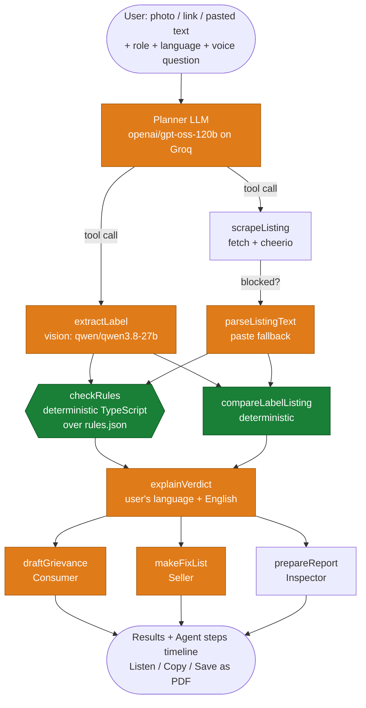

# Jaanch · जाँच

**Packet ki jaanch, aapki bhasha mein.**

Jaanch is an agentic AI web app that checks whether a packaged product's label follows India's
**Legal Metrology (Packaged Commodities) Rules, 2011**, explains the result in the user's own
Indian language (text + voice), and then takes the next step for them:

| Role | Action |
| --- | --- |
| Consumer | Drafts a grievance for the National Consumer Helpline (user's language + English copy) |
| MSME seller | Produces a fix-list of corrected label content |
| Inspector | Generates a printable compliance report (Save as PDF) |

Live: **https://jaanch-delta.vercel.app** · Built for Bharat Agentic 2026 (12-hour hackathon).
Inspired by **SIH 2026 PS 26034** (Ministry of Consumer Affairs, Food and Public Distribution).

> **Disclaimer:** Jaanch is an assistive tool, not an official Legal Metrology finding.

---

## Problem

Every pre-packaged commodity sold in India must carry a fixed set of declarations: the
manufacturer / packer / importer with a full address, the generic name, net quantity in standard
units, month and year of packing, MRP *inclusive of all taxes*, consumer-care contact details and
(for imports) the country of origin. Shoppers rarely know these rules, small sellers get penalised for
mistakes they never noticed, and inspectors check packs by hand. The rules exist mostly as English
legalese.

## Solution

1. Upload a photo of the back of the pack, paste an e-commerce link, or paste the listing text.
2. An **agent** (LLM planner with tool calling) reads the label with a vision model, runs a
   **deterministic rule engine**, compares the pack with the online listing, and explains the verdict
   in Hindi, Tamil, Bengali, Marathi, Telugu or English — spoken aloud on request.
3. Every tool call is streamed to the UI as an **Agent steps** timeline (tool, the planner's reason,
   output summary, time taken), so you can see it is a real agent, not a chatbot.
4. The run ends with the role-specific action: grievance, fix-list or report.

**Pass/fail decisions are made only by the rule engine (`src/lib/tools/check-rules.ts` over
`src/data/rules.json`). The LLM extracts, plans, explains and drafts — it never decides compliance.**

## Agent workflow



Green = deterministic TypeScript. Orange = open-weight LLM calls.

### Tools (`src/lib/tools/`)

| Tool | What it does |
| --- | --- |
| `extractLabel(image)` | Vision model returns structured JSON of every declaration (any Indian script), plus bounding boxes of the MRP line and a body-text line used to **estimate** text size deterministically. Missing fields are `null`. |
| `scrapeListing(url)` | `fetch` + cheerio: JSON-LD Product data, spec tables, key-value rows. Amazon / Flipkart / BigBasket block server requests, so it returns a clear error and the UI asks for pasted text. |
| `parseListingText(text)` | Structures pasted listing text into the same declaration JSON. |
| `checkRules(declarations)` | Deterministic engine. Per rule: `PASS` / `FAIL` / `MISSING` / `NEEDS_REVIEW`, severity, reason, rule id and source. Exemptions (e.g. Rule 26(a) packs ≤ 10 g / 10 ml) are data in `rules.json`. Text-size checks are **only ever** `NEEDS_REVIEW`. |
| `compareLabelListing(label, listing)` | Mismatches on MRP, net quantity (unit-normalised), manufacturer, country of origin. |
| `explainVerdict` / `translate` | Plain-language verdict in the chosen language + English, from deterministic facts only. |
| `draftGrievance(results, language)` | Deterministic English complaint letter, translated by the LLM. |
| `makeFixList(results, language)` | Corrected label text per failing rule (with unit conversions, e.g. 7 oz → 198 g). |

The agent loop lives in `src/lib/agent/run.ts` (Vercel AI SDK `generateText` with multi-step tool
calling). Tools read and write a shared run context so the planner never has to echo large JSON,
which keeps token use inside Groq's free-tier limits. If the planner model is unavailable, a scripted
fallback runs the same tools in order and the timeline says so.

## What makes it demo-proof and judge-friendly

- **Agent steps timeline** streams every tool call with the planner's own one-line reason, output summary and timing.
- **`/rules` transparency page**: all 12 rules with clause, source PDF link and `verified` badge — the LLM never decides compliance.
- **11 unit tests** pin the rule engine, comparison and fix-list behaviour (`npm test`).
- **Vernacular UI**: form, verdict and action labels switch to Hindi, Marathi, Tamil, Bengali or Telugu with the language selector (deterministic strings, no LLM).
- **WhatsApp share** for the grievance, **Listen** for spoken verdicts, **Save as PDF** reports with correct Indic rendering.
- **Installable PWA** (manifest + icons) so the demo runs from a phone's home screen with the camera.
- **Resilience**: client-side image compression, streaming progress, friendly rate-limit / quota messages, scripted fallback if the planner model is down, optional fallback provider, and cached real extractions for the bundled samples when the live vision model is unavailable (clearly badged "cached" in the timeline).
- See [DEMO.md](DEMO.md) for a 3-minute demo script and Q&A notes.

## Tech stack

- **Next.js 16** (App Router, TypeScript) + **Tailwind CSS v4** + **shadcn/ui** — one project, API routes as backend, deployed on **Vercel**
- **Vercel AI SDK** (`ai`, `@ai-sdk/groq`, `@ai-sdk/openai-compatible`) — tool calling, multi-step agent loop
- **Open-weight models on Groq**: `qwen/qwen3.8-27b` (vision + tools), `openai/gpt-oss-120b` (planner), `openai/gpt-oss-20b` (drafting/translation helper). All configurable by env.
- **cheerio** scraping, **zod** validation, **sharp** for test-label rendering, **mermaid** for the architecture diagram
- **Web Speech API** — `SpeechRecognition` for voice questions, `speechSynthesis` for spoken verdicts (hi-IN, ta-IN, bn-IN, mr-IN, te-IN, en-IN)
- **Noto Sans** + Noto Sans Devanagari / Tamil / Bengali / Telugu from Google Fonts; reports are print-friendly HTML saved as PDF via `window.print()` (no pdf-lib / react-pdf, which render Indic scripts badly)
- No database. All state stays on the client.

## Setup

```bash
git clone https://github.com/PulkitChatwal/jaanch
cd jaanch
npm install
cp .env.example .env.local   # add your GROQ_API_KEY
npm run dev                  # http://localhost:3000
```

### Environment variables (`.env.example`)

| Variable | Purpose | Default |
| --- | --- | --- |
| `GROQ_API_KEY` | Groq API key (https://console.groq.com/keys) | — |
| `VISION_MODEL` | Open-weight vision model with tool calling on Groq | `qwen/qwen3.8-27b` |
| `TEXT_MODEL` | Planner model | `openai/gpt-oss-120b` |
| `HELPER_MODEL` | Optional model for drafting/translation (spreads Groq's per-model rate limits) | `openai/gpt-oss-20b` |
| `AI_PROVIDER` | `groq` (default) or any OpenAI-compatible provider serving open weights (OpenRouter, HF Inference Providers) | `groq` |
| `FALLBACK_BASE_URL`, `FALLBACK_API_KEY`, `FALLBACK_VISION_MODEL`, `FALLBACK_TEXT_MODEL` | Used when `AI_PROVIDER` is not `groq` | — |

### Scripts

```bash
npm run labels   # regenerate the 10 synthetic test labels (SVG -> PNG via sharp)
npm run verify   # run extractLabel + checkRules over all 10 labels and print a results table
npm test         # rule-engine unit tests (node:test)
npm run build    # production build
npm run lint
```

`npm run verify` output on the current models (one label still depends on the vision model's bounding-box estimate):

```
#  label                     verdict       FAIL/MISSING                   NEEDS_REVIEW   expected
01 01-compliant-en.png       COMPLIANT     -                              -              ✓
02 02-missing-mrp.png        VIOLATIONS    6-1-e-MRP:M 6-1-e-MRP-TAXES:M  -              ✓
03 03-mrp-no-taxes.png       VIOLATIONS    6-1-e-MRP-TAXES:F              -              ✓
04 04-missing-care.png       VIOLATIONS    6-2-CONSUMER-CARE:M            -              ✓
05 05-nonstandard-units.png  VIOLATIONS    13-STANDARD-UNITS:F            -              ✓
06 06-missing-address.png    VIOLATIONS    6-1-a-ADDRESS:M                -              ✓
07 07-missing-date.png       VIOLATIONS    6-1-d-DATE:M                   -              ✓
08 08-import-no-origin.png   VIOLATIONS    6-1-aa-ORIGIN:M                -              ✓
09 09-tiny-text.png          NEEDS_REVIEW  -                              7-2-TEXT-SIZE  ✓ / ✗ (model-dependent)
10 10-compliant-hi.png       COMPLIANT     -                              -              ✓
```

## Deploy to Vercel

```bash
npm i -g vercel
vercel link
vercel env add GROQ_API_KEY production     # repeat for VISION_MODEL, TEXT_MODEL, HELPER_MODEL, AI_PROVIDER
vercel --prod
```

Notes: images are compressed on the client (max 1600 px, under 3 MB) because Vercel limits request
bodies to about 4.5 MB; `/api/jaanch` sets `maxDuration = 120` and streams NDJSON events so the UI
shows progress instead of blocking on one slow call. Rate limits and model errors surface as a
friendly message with a Retry button.

## Test labels (`public/test-labels/`)

All brands, addresses, phone numbers and licence numbers are fictional. Generated by `scripts/make-labels.ts`.

1. Fully compliant (English) — Sunrise Valley poha
2. Missing MRP — Nilgiri Breeze tea
3. MRP without "inclusive of all taxes" — Dakshin Masala sambar powder
4. Missing consumer care details — Hima Honey
5. Net quantity in non-standard units (7 oz) — Megha Bakes cookies
6. Missing manufacturer address — Pure Harvest peanuts
7. Missing date of manufacture/packing — Rajdhani Grains rice
8. Imported product without country of origin — Costa Verde olive oil
9. Very small declaration text — Devi Daily toor dal
10. Fully compliant Hindi (Devanagari) label — अन्नपूर्णा चना दाल

Use **Try a sample** on the home page to load any of them.

## Rules data (`src/data/rules.json`)

Twelve rules covering the mandatory declarations: name and address of manufacturer / packer /
importer (Rule 6(1)(a), 10(1)), country of origin for imports (6(1)(aa)), common or generic name
(6(1)(b)), net quantity (6(1)(c)) in standard units (Rule 13), month and year of manufacture (6(1)(d)),
MRP (6(1)(e), 2(m)) in the "inclusive of all taxes" form, consumer care details (6(2)), language
(9(4)) and minimum letter height (7(2) Table I — review only). Exemption data: Rule 26(a) for packs
of 10 g / 10 ml or less (not tobacco).

Every rule carries a `source` field pointing at the Department of Consumer Affairs' consolidated
text (`sourceDocument` in the file) and **`"verified": false`** — the team must verify each one
against the official notification before relying on it. No clause has been invented; descriptions
paraphrase the consolidated text fetched during the build.

## Assumptions made

- **Models.** Groq's current open-weight vision model with tool calling is `qwen/qwen3.8-27b`; Llama 3.3 70B is now enterprise-only on Groq, so the planner defaults to `openai/gpt-oss-120b` (Apache-2.0 open weights). Reasoning is disabled / set to low on these models because at default effort they spend the whole output budget thinking.
- **Rate limits.** Groq's free tier allows ~8,000 tokens per minute **and ~200,000 tokens per rolling day** per model. One check uses roughly one vision call (~4K tokens) plus a few small text calls, so the free tier gives about 50 label checks a day and back-to-back checks may wait ~30 s; the UI shows a clear message when either limit is hit. Set `FALLBACK_API_KEY` (OpenRouter / HF Inference Providers, open-weight models) to switch over automatically, or upgrade to Groq's Dev tier before a demo. A separate helper model spreads the per-model load.
- **Rule statuses.** In addition to `PASS` / `FAIL` / `MISSING` / `NEEDS_REVIEW`, rules that do not apply (e.g. country of origin for a domestic product) are listed separately as not applicable rather than counted.
- **Exemptions** downgrade a `FAIL` / `MISSING` to `NEEDS_REVIEW` with the exemption named, rather than hiding the rule, so a human can confirm the exemption applies.
- **Text size** cannot be measured from a photo. The vision model returns bounding boxes for the MRP line and a body-text line; if the declaration line is clearly shorter than body text it is flagged for review. This is an estimate and is model-dependent.
- **Country of origin** is only accepted when the label text contains an explicit "Country of Origin" / "Made in" / "मूल देश" statement; a value inferred from an address is flagged for review.
- **Consumer care** passes when both a phone number and an e-mail are found, is flagged when only one is found, and is missing when neither is.
- **Listing-only checks.** If there is no usable label photo but a listing was parsed, the rule engine runs on the listing text and the verdict says so; listings usually omit the packing date and consumer-care details, so those "missing" findings must be confirmed on the physical pack.
- **Scraping.** Major Indian marketplaces block server-side fetches; the paste-text fallback is the expected path and is what the demo uses.
- **Report hand-off.** The `/report` page receives the finished run through `sessionStorage` in the same tab (regenerable, cleared on tab close). Nothing important is stored in `localStorage`.
- **Food, cosmetics and drugs** have sector-specific labelling laws (FSS Act, Drugs & Cosmetics Rules); Jaanch applies the Legal Metrology declarations only and says so in the rule descriptions.
- **Voice** uses the browser's Web Speech API; recognition quality varies by browser and language (Chrome works best).

## Credits

- Problem inspiration: **SIH 2026 PS 26034**, Ministry of Consumer Affairs, Food and Public Distribution, Government of India
- Rules text: Department of Consumer Affairs — *Legal Metrology (Packaged Commodities) Rules, 2011 with all amendments*
- Open-weight models served by **Groq**: Qwen 3.8 27B (Alibaba), gpt-oss-120b / 20b (OpenAI, Apache-2.0)
- Open-source libraries: Next.js, React, TypeScript, Tailwind CSS, shadcn/ui, Radix UI, lucide-react, Vercel AI SDK, cheerio, zod, sharp, mermaid, next-themes, tsx
- Fonts: Noto Sans family (Google Fonts, SIL OFL)
- Built with Claude Code.

## License

MIT — see [LICENSE](LICENSE).

*Jaanch is an assistive tool, not an official Legal Metrology finding.*
